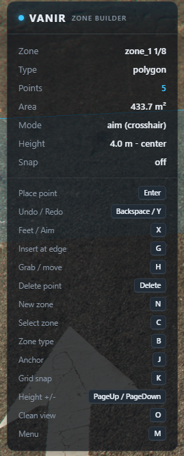
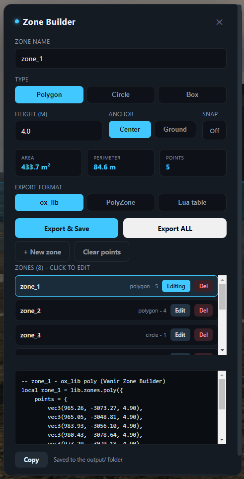

# Vanir Zone Builder

**Draw zones in-game - polygons, circles and boxes - then export clean code in one click.** No more flying around copy-pasting coordinates into a config by hand.

Free. Standalone. Zero dependencies. Works on any framework (ESX, QBCore, Qbox, or none).

<table>
<tr>
<td valign="top"></td>
<td valign="top"></td>
</tr>
</table>

---

## Why

Almost every gang / turf / dealer / safezone script makes you author zones by pasting raw coordinates into a Lua table. Vanir Zone Builder turns that into a 30-second job: walk the corners (or point at them), shape it, and copy ready-to-use code for **ox_lib**, **PolyZone**, or a plain Lua table.

## Features

- **Three zone types** - polygon, circle (centre + radius) and box (two corners).
- **Two placement modes** - `feet` (drop where you stand) or `aim` (drop where your crosshair hits).
- **Full point editing** - insert a point into the nearest edge, grab & move any vertex, delete the nearest vertex, with **undo / redo**.
- **Live 3D preview** - vertices, numbered labels, translucent walls, and a live **area / perimeter** readout.
- **Adjustable height** with a **center / ground** anchor.
- **Grid snap** for tidy, aligned zones.
- **Zone manager** - build several zones in one session, keep them in a list, reload or delete them, and **export all** into a single file.
- **One-click export** - copies to clipboard *and* saves to the resource `output/` folder. JSON is saved alongside.
- **Rock-solid keys** - in-editor keys are read straight from the keyboard, so what the HUD shows is exactly what fires.
- **Clean & light** - 0.00 ms when idle; the loop only runs while the editor is open.

## Install

1. Drop `vnr_zonebuilder` into your server's `resources`.
2. Add to `server.cfg`: `ensure vnr_zonebuilder`
3. Restart the server.

## Controls

| Action | Key |
|---|---|
| Toggle editor | `F7` |
| Place point / drop grabbed vertex | `Enter` |
| Undo / Redo | `Backspace` / `Y` |
| Feet / aim placement | `X` |
| Insert at nearest edge (polygons) | `G` |
| Grab / move nearest vertex | `H` |
| Delete nearest vertex (polygons) | `Delete` |
| New zone | `N` |
| Select nearest zone | `C` |
| Cycle zone type (poly/circle/box) | `B` |
| Height anchor (center/ground) | `J` |
| Toggle grid snap | `K` |
| Raise / lower height | `PageUp` / `PageDown` |
| Clean view (hide HUD + dots, keep zones) | `O` |
| Open menu | `M` |

> Every key is a FiveM key binding, rebindable in **Settings -> Key Bindings -> FiveM** (search "Zone Builder"). Defaults are set in `config.lua` (the `default` field is a FiveM key-mapper name such as `RETURN`, `BACK`, `PAGEUP`).

## Usage

1. **F7** to open. Pick a type with **B** (or in the menu).
2. **Polygon:** walk/aim the corners, **Enter** at each. **Circle:** Enter once for the centre, again on the rim. **Box:** Enter on two opposite corners.
3. Tidy it: **G** to insert a point, **H** to drag a vertex, **Delete** to remove one, **Backspace/Y** to undo/redo.
4. Build several zones at once: every zone stays visible. **N** finishes the current one and starts a new zone; **C** makes the zone nearest your cursor active to edit it; the menu lists all zones with **Edit** / **Del**.
5. **M** to name it, choose a format, **Export & Save**, then **Copy** (or grab the file from `vnr_zonebuilder/output/`). **Export ALL** writes every zone into one file.
6. Want a clean shot? **O** hides the HUD and dots and keeps just the zone shapes on screen.

## Export example (ox_lib, polygon)

```lua
local downtown = lib.zones.poly({
    points = {
        vec3(215.41, -810.22, 30.10),
        vec3(248.77, -795.13, 30.10),
        vec3(233.05, -762.84, 30.10),
    },
    thickness = 4.0,
    debug = false,
    onEnter = function(self) end,
    onExit = function(self) end,
})
```

## Notes

- Saving uses the server native `SaveResourceFile`. To restrict who can export, set `Config.RequireAce = true` and grant the ace `vnr_zonebuilder.save` in `server.cfg`.
- ox_lib zones use a single z plane plus a thickness, so a polygon export flattens to one plane spanning the zone's full vertical range (this keeps it matching the preview on sloped ground).
- Exporting two zones with the same name writes to the same file, so give zones distinct names. **Export ALL** auto-uniquifies names (`foo`, `foo_2`).
- All colours, keys, grid size and defaults live in `config.lua`.

---

Made by **Alvaner** (Vanir).
